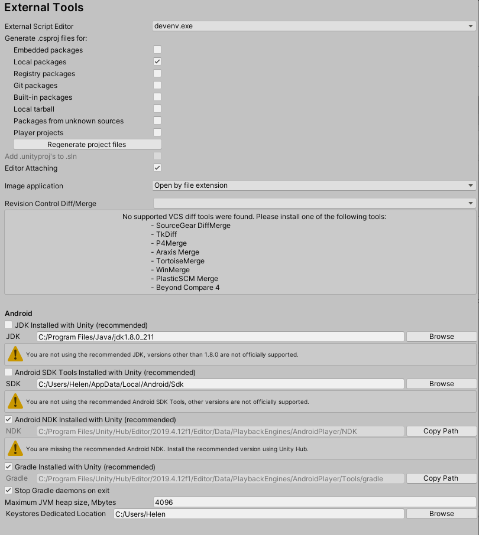

# Raycast Android Hololens

This is a unity project that deploys to both the Android phone and the Hololens. After both the Hololens and the Android phone has looked at the image target, you can tap anywhere on the Android screen and the target (a cube) will appear where you tapped. This cube is dependent on the world mesh generated by the Hololens. 

## Basic Flow & Pipelining

The Android device hosts the server. The server will automatically start when the Android app is started. The Hololens is the client, and will also automatically try and join the server when the Hololens is started. **Please start the Android app before the Hololens app to ensure the server is running before the client attempts to connect.**

### Raycasting & Transformations Math

a) When we tap the Android screen, the Android calculates 3 things: 

1. The image target's name (useful later on when we have more than one image target)
2. The camera (phone) position **with respect to (w.r.t) the image target's world position (in terms of the Android's world)**
3. The ray direction  **in world space**

b) The Android then sends the 3 pieces of information described above to the Hololens

c) The Hololens receives the information and casts a ray: 

1. First, the Hololens takes the sent phone position and adds it to the world position of the image target. This will get the phone camera's world position (in terms of the Hololens world). 
2. Then, we construct a ray with the phone camera's world position as the origin and the sent ray direction
3. Next, we calculate the ray's intersection against the generated collider mesh. 
4. Finally, we subtract the image target's position from the intersection point's position to get the intersection point w.r.t the image target, and send that data back to the Android

d) Once the Android receives the intersection point data from the Hololens, it adds the image target's world position to the sent intersection point, which gets the intersection point's position in world space (in terms of the Android world). The target marker's transformation position is ultimately set to this position. 

## Building & Deploying

There is only one scene in the project: 0-Main. Before you build either Android or Hololens, **make sure to change the IP address to be your local network.** This is changed by going to the NetworkManager scene object --> Basic Net Manager Component --> Network Address

### Android

To build and deploy to the Android, follow these steps:

1. Make sure the target platform in Build Settings is set to Android. 
2. There is a component called Ray Cast Controller attached to the ImageTarget scene object. **Please make sure to set the Build Type to Android**.
3. Have the phone plugged in via USB into the computer
4. Click Build and Run
5. Once done, the app will automatically start if/when the phone is unlocked. You might have to approve it the first time. 
6. If the app has trouble deploying to the phone, make sure you have developer mode turned on in your Android device. 

### Hololens

1. Make sure the target platform in Build Settings is set to Universal Windows Platform. 

2. There is a component called Ray Cast Controller attached to the ImageTarget scene object. **Please make sure to set the Build Type to Hololens**.

3. Click Build (NOT build & run)

4. Once done, a Visual Studios solution will be generated. Open it up in Visual Studios. 

5. Make sure the RaycastHololens project is set as the active project. For Hololens 1, change Build mode to be Release and x86. Change the target to build to Device.

   

6. Plug in the Hololens into the computer via USB

7. Run and the app will automatically start on the Hololens

8. If the app has trouble deploying to the Hololens 1, trying using Visual Studios 2017. 

## Important Scripts & Components

### ARCamera (Scene Object)

The AR Camera is our main camera so Hololens and Android can track image targets. The Camera must have a black solid color as the background for the Hololens. Attached to the ARCamera is a Vuforia Behavior Script, which sets the configs for Vuforia. More details on Vuforia configs is in the configs settings below. 

### Image Target (Scene Object)

This is the picture that is actually being tracked. Right now, it's a picture of the Hunger Games book. You can change the image target picture by making a Vuforia license and database, changing the license in the Vuforia configs, and using a different picture from your database for the image target.  **Everything that is tracked by the image target must be a child of the image target**. Currently, the image target tracks a sphere (so we know the target is working), and a target marker.

The ImageTarget object has a Ray Cast Controller script attached to it. This is crucial for raycasting and client server to work. More details of this script are below. 

### Ray Cast Controller (Script)

This script handles all the raycasting and message sending for the Hololens and Android. Essentially, this is the script that does most of the work of this app. 

1) Depending on the build type, it tells the app to start the client or the server. This will also register message handlers, which are important for communicating between the client and server.

2) If the build type is the server, the script will check for click or tap inputs.  When these events occur, it will calculate the necessary information and send it to the client.

3) The Hololens raycasting function is also in this script, and is in charge of raycasting against the spatial mesh and sending the information back to the android.

4) The android receiving function sets the target to the right position based on the Hololens raycasting. 

### Target (Scene Object)

Target is a child of the image target. Initially, it starts as inactive. Only when the user clicks on the Android device is the target set as active and its position is set to be where the user tapped. 

### Spatial Manager (Scene Object)

This is in charge of building and visualizing the spatial mesh on the Hololens. The Spatial Mapping Renderer component is in charge of visualizing this mesh. In order to do so, you have to set the Render State to Visualization. Otherwise, if you don't want to see the generated mesh, set it to None. The Spatial Mapping Collider is in charge of making objects to collide against when we raycast. It's important to have the Mesh Layer be a custom layer so that in the Ray Cast Controller script we can raycast against only this layer. **In order for this feature to work, spatial perception mush be turn on in the build settings.**

### Network Manager (Scene Object)

This is in charge of the actual client and server work. You would set the ip here, and instantiate player prefabs. **Currently, the player prefab is just a dummy because it doesn't need to do anything**. This has a lot of the scripts given to us by the Mirror Network plugin, but right now it's pretty basic. 

## Unity Configs

This project uses two plugins: Vuforia and Mirror Networking

### Android

### Hololens

### Image Target

## Future Work

- Currently, there is only one marker (target) and it's set based on where you tap. In the future, it would be good to display a series of geometry based on the fingerpress path, allowing you to draw in the 3D space. 
- Only the Android sees the marker. In the future, the Hololens would also need to see the marker and update its position. 
- The phone overheats and throttles because it is hosting the server and image tracking, so there needs to be improvements in that. 
- It is assumed that there is only one image target. In the future, we would have to check which one is currently being tracked on the screen and display the marker w.r.t to that image target. 

